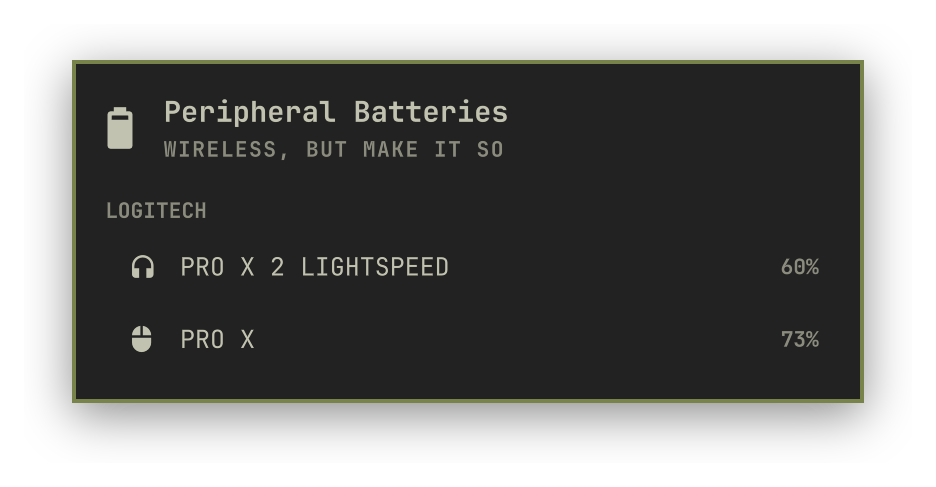
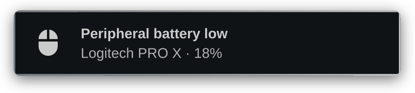
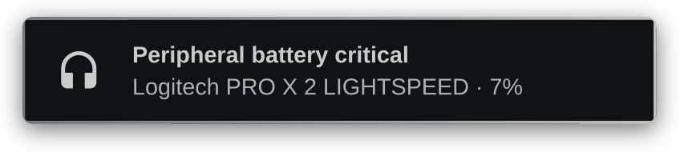
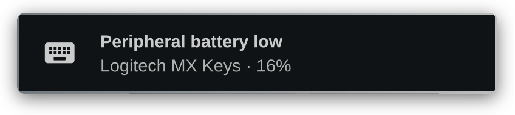
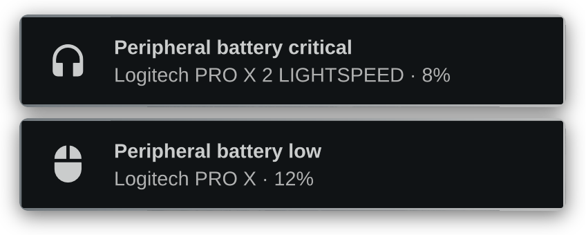

# Peripheral Batteries for Omarchy

An Omarchy bar widget for wireless mice, keyboards, headsets and controllers:
battery percent for each one, grouped by brand, with a low-battery colour and a
desktop notification. It reads `/sys` through a small Python helper, so there is
no daemon and no dependencies beyond the Python 3 already on the system.

<p align="center">
  
</p>

## Features

- Presence and percent for every wireless peripheral the kernel already reports
- Brand groups when the manufacturer or USB vendor id is known, so a known brand
  gets a header and a no-name dongle gets none
- Placeholder names when the kernel gives none: `Mouse 1`, `Headset 2`,
  `Device 1`. Missing identity never errors the widget, and a missing percent
  reads `--`
- Warning and critical thresholds you set on the bar, driving both the colour
  and the notification
- Notifications in Omarchy's own style, with a per-kind glyph, and one alert per
  device: a device is warned once, again if it turns critical, and not again
  until it has charged back above the threshold

Laptop packs belong to `omarchy.power` and never appear here. Volume, connect
and forget stay with the stock Audio and Bluetooth panels.

## Install

```bash
omarchy plugin add https://github.com/xgborgeso/omarchy-peripheral-batteries.git --enable
```

`--enable` puts the chip on the right of the bar. Gaming headsets the kernel does
not expose, a PRO X 2 LIGHTSPEED for example, need
[headsetcontrol](https://github.com/Sapd/HeadsetControl) on `PATH`:
`omarchy pkg add headsetcontrol`, then unplug and replug the dongle so its udev
rules apply.

## Settings

| Key | Default | What it does |
| --- | --- | --- |
| `hideWhenDisconnected` | `true` | Hide the icon while nothing wireless is present. An error keeps it visible. |
| `refreshIntervalSec` | `30` | Poll cadence, in seconds. |
| `lowBatteryPercent` | `20` | Warning threshold, in percent. |
| `criticalBatteryPercent` | `10` | Critical threshold, in percent. |
| `notifyOnLow` | `true` | Send a desktop notification on low battery. |
| `notifyRepeatMinutes` | `0` | Re-notify while still low. `0` notifies once. |

```bash
omarchy bar set io.github.xgborgeso.peripheral-batteries hideWhenDisconnected false --json
omarchy bar move io.github.xgborgeso.peripheral-batteries --section right
```

<details>
<summary>What the notifications look like</summary>

<br>

A device is warned once when it crosses `lowBatteryPercent`, once more if it
falls past `criticalBatteryPercent`, and not again until it has charged back
above the threshold. Each alert carries the glyph for its kind.








Two devices crossing the threshold in the same poll are both warned:



</details>

## Controls

Left click opens the panel, middle click refreshes.

| Key | Action |
| --- | --- |
| `r` | Refresh |
| `Tab` | Next stock panel |
| `Esc` | Close |

The panel is also scriptable:
`omarchy-shell io.github.xgborgeso.peripheral-batteries toggle|refresh|status`.

## Helper

`helper/status.py` is the only part that touches the system, and it only runs for
the length of one call:

```bash
python3 helper/status.py
```

It reads `/sys` only, never opens `/dev/hidraw`, and prints one line of JSON and
exits 0 whatever happens. The `ok` and `error` fields say which state it is in.
`PERIPHERALS_SYSFS` points it at another tree, which is how the tests run:

```bash
python3 tests/helper.test.py
node tests/model.test.js
omarchy plugin validate .
```

## Remove

```bash
omarchy plugin remove io.github.xgborgeso.peripheral-batteries
```

## License

MIT. Not affiliated with any peripheral vendor.
